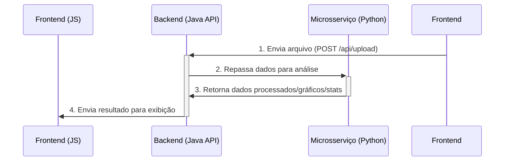

# Business Data Test Toolkit

Uma ferramenta web projetada para centralizar e simplificar a análise de testes A/B. A aplicação guia analistas de negócio e operações desde o upload e tratamento de uma base de dados (CSV/XLSX) até a geração de visualizações e o cálculo de resultados estatísticos, tudo em um fluxo de trabalho sequencial e intuitivo.

---

### Status Atual do Projeto: Fase de Concepção

**Atenção:** Este projeto está atualmente na fase de **Concepção e Planejamento**. O código ainda não foi iniciado.

O objetivo deste `README` é servir como uma documentação viva do processo de design da solução e da arquitetura. Ele demonstra a capacidade de quebrar um problema complexo em um plano de execução claro, definindo escopo, requisitos, fluxo de usuário e stack tecnológica antes mesmo de escrever a primeira linha de código.

---

### O Problema

Analistas de negócio e operações frequentemente precisam analisar resultados de testes A/B a partir de bases de dados brutas. Esse processo costuma ser manual, fragmentado em diferentes ferramentas (planilhas para limpeza, scripts para análise, softwares para visualização) e propenso a erros. A falta de um ambiente centralizado torna a análise demorada e menos eficiente.

### Funcionalidades Planejadas (Escopo do MVP)

O Mínimo Produto Viável (MVP) será focado em entregar um fluxo completo de análise em três etapas principais:

1.  **Etapa 1: Upload e Tratamento de Dados**
    * Upload de arquivos nos formatos `.csv` e `.xlsx`.
    * Processamento automático para remover valores nulos e linhas duplicadas.
    * Feedback visual para o usuário sobre o status do processamento (em andamento, concluído, erro).

2.  **Etapa 2: Visualização Exploratória**
    * Permitir que o usuário selecione colunas para gerar gráficos.
    * Geração de visualizações chave:
        * Gráficos para identificar **outliers** (ex: Boxplot).
        * Gráficos para analisar **dispersão** (ex: Gráfico de Dispersão).
        * Gráficos para visualizar **correlação** (ex: Heatmap).
    * Exibição dos gráficos em uma interface limpa com opção de download para cada imagem.

3.  **Etapa 3: Análise Estatística de Teste A/B**
    * Permitir que o usuário defina qual coluna representa o grupo de **controle** e o de **tratamento**.
    * Cálculo automático de métricas estatísticas essenciais:
        * Métricas descritivas (Média, Mínimo, Máximo).
        * Diferença de conversão/média entre os grupos.
        * Cálculo de significância estatística (p-valor).
    * Apresentação clara dos resultados para tomada de decisão.

### Fluxo de Experiência do Usuário (UX)

A interface será uma **página única (Single-Page Application)**, totalmente focada em desktop, com a jornada do usuário dividida em blocos sequenciais.

* **Navegação por Blocos:** O usuário progride do Bloco 1 ao Bloco 3. Um bloco só é desbloqueado após a conclusão do anterior.
* **Foco na Etapa Atual:** O bloco ativo ocupará a maior parte da tela, mantendo o usuário focado na tarefa atual.
* **Visualização e Bloqueio:** Será possível navegar para visualizar blocos anteriores já concluídos, mas sem a possibilidade de modificá-los, garantindo a integridade do fluxo.
* **Flexibilidade:** O usuário poderá pular blocos de visualização (que se tornarão inacessíveis) ou recomeçar todo o processo mediante confirmação.

### Arquitetura e Stack Tecnológica Proposta

Para atingir o objetivo de aplicar conhecimentos em Java e Python, a arquitetura proposta é baseada em um modelo híbrido de **Backend com Microsserviço**, que é um padrão moderno e eficiente.

* **Frontend**:
    * **Tecnologia:** HTML5, CSS3, JavaScript (Vanilla).
    * **Bibliotecas:** [Chart.js](https://www.chartjs.org/) para renderização dinâmica dos gráficos e [Axios](https://axios-http.com/) para as chamadas à API.
    * **Justificativa:** Leve, rápido e mantém o foco do projeto no desenvolvimento do backend, sem a necessidade de um framework complexo para a UI proposta.

* **Backend (API Gateway & Orquestração)**:
    * **Tecnologia:** **Java 17+** com **Spring Boot**.
    * **Responsabilidades:** Servir o frontend, gerenciar os endpoints da API, receber as requisições do usuário e orquestrar as chamadas para o microsserviço de análise.
    * **Justificativa:** Ecossistema robusto, ideal para construir APIs seguras e escaláveis, cumprindo o objetivo de aplicar conhecimentos em Java.

* **Microsserviço (Análise de Dados)**:
    * **Tecnologia:** **Python 3.9+** com **FastAPI** ou **Flask**.
    * **Bibliotecas:**
        * **Pandas:** Para toda a manipulação e limpeza de dados.
        * **Matplotlib/Seaborn:** Para a geração das imagens dos gráficos.
        * **SciPy/Statsmodels:** Para os cálculos de significância estatística.
    * **Justificativa:** Utiliza o ecossistema de Data Science mais poderoso do mercado, tornando a implementação das funcionalidades de análise muito mais direta e eficiente.

### Roadmap do Projeto

#### Fase 1: Concepção e Planejamento (Etapa Atual)
- [x] Definição do problema e do público-alvo.
- [x] Elaboração dos requisitos funcionais e não-funcionais.
- [x] Definição do escopo do MVP.
- [x] Desenho do fluxo de usuário (UX) e da interface (UI).
- [x] Escolha e desenho da arquitetura e da stack tecnológica.
- [x] Criação do plano de tarefas (Kanban).

#### Fase 2: Desenvolvimento do MVP
- **Setup do Ambiente:**
    - [ ] Inicializar repositório Git.
    - [ ] Configurar projeto Spring Boot.
    * [ ] Configurar ambiente Python com as bibliotecas de dados.
- **Desenvolvimento do Microsserviço (Python):**
    * [ ] Implementar endpoint para tratamento de dados.
    * [ ] Implementar endpoint para geração de gráficos.
    * [ ] Implementar endpoint para análise estatística.
- **Desenvolvimento do Backend (Java):**
    - [ ] Implementar endpoints da API para o frontend.
    - [ ] Implementar a lógica de orquestração para chamar o serviço Python.
- **Desenvolvimento do Frontend:**
    - [ ] Estruturar o HTML e CSS com o layout de blocos.
    - [ ] Implementar a lógica de upload e as chamadas à API.
    - [ ] Implementar a lógica de navegação entre blocos.
    - [ ] Implementar a exibição dos resultados (gráficos e estatísticas).

#### Fase 3: Features Futuras (Pós-MVP)
- [ ] Conexão com bancos de dados via JDBC.
- [ ] Autenticação de usuários para salvar histórico de análises.
- [ ] Mais opções de gráficos e testes estatísticos.
- [ ] Exportação do relatório final em PDF.
